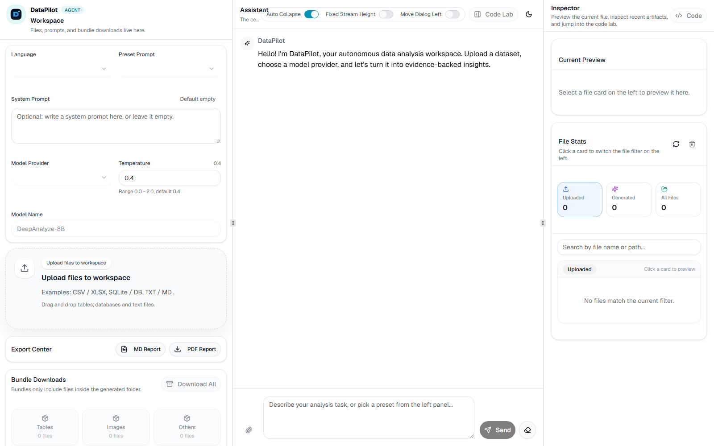

# DataPilot

[](https://github.com/mingzhuoFUN/DataPilot/actions/workflows/ci.yml)
[](LICENSE)

DataPilot 是一个可在浏览器中使用的自主数据分析工作台。用户可以上传 CSV、Excel、数据库或文档，以自然语言描述任务，并查看模型的流式分析、Python 执行、图表与可下载报告。

## 在线体验

公开网站：[https://datapilot-cloud.fmingzhuo.chatgpt.site](https://datapilot-cloud.fmingzhuo.chatgpt.site)

在线版支持阿里千问、OpenAI 及其他 OpenAI 兼容 API。API Key 仅用于当前分析请求，不会写入代码仓库或浏览器存储。

本仓库以 [ruc-datalab/DeepAnalyze](https://github.com/ruc-datalab/DeepAnalyze) 的开源代码为基础，保留其 WebUI 视觉基准、模型协议、训练和评测资源，在此基础上完成远程模型配置、安全边界、容器化和持续集成。项目不声称训练了 DeepAnalyze-8B，详细归属见 [UPSTREAM.md](UPSTREAM.md)。



## 已完成能力

- 基于上游 WebUI v2 视觉基准的三栏式 Next.js 数据分析工作台
- FastAPI 文件、对话、代码执行、预览和报告导出 API
- CSV / XLSX / SQLite / 文本 / 文档工作区
- `<Analyze>`、`<Code>`、`<Execute>`、`<Answer>` 流式协议解析
- OpenAI 兼容远程 API，可由服务端统一锁定配置
- 无权重 mock provider，可完整演示上传、流式响应和报告生成
- Nginx + frontend + backend + mock 的 Docker Compose 一键编排
- 上传限制、会话目录净化、外部代理关闭、执行环境密钥剥离
- Pytest、Python compile、Next.js production build 和 Compose CI
- 独立 DataPilot 视觉语言：分析航线式品牌头部、青绿/橙色主题、引擎状态与结果观测站

## 最快启动：不下载模型权重

安装 Docker Desktop 后执行：

```bash
git clone https://github.com/mingzhuoFUN/DataPilot.git
cd DataPilot
docker compose up --build
```

打开 <http://localhost:8080>。默认 mock 服务不需要 GPU、模型权重或 API key，它验证的是完整产品链路，不提供真实数据推理。

## 接入远程模型 API

复制环境变量模板：

```bash
cp .env.example .env
```

修改 `.env`：

```dotenv
DATAPILOT_MODEL_PROVIDER=custom
DATAPILOT_MODEL_API_BASE=https://your-provider.example/v1
DATAPILOT_MODEL_NAME=your-model-name
DATAPILOT_MODEL_API_KEY=your-secret-key
DATAPILOT_ALLOW_CLIENT_PROVIDER_CONFIG=false
```

然后执行 `docker compose up --build`。远程服务需要兼容 OpenAI `POST /v1/chat/completions` 流式接口。API key 只放在本地或云平台 Secret 中，禁止提交到 Git。

## 本地开发

### 使用本机 DeepAnalyze-8B 权重（Windows + NVIDIA GPU）

本项目已在 RTX 4060 Laptop 8GB 上使用 llama.cpp Vulkan 与 Q4_K_M GGUF 完成真实推理验证。权重不包含在 Git 仓库中。当前机器配置好权重与运行时后，可在仓库根目录执行：

```powershell
powershell -ExecutionPolicy Bypass -File .\scripts\start_local.ps1
```

随后打开 <http://127.0.0.1:4000>。停止全部服务：

```powershell
powershell -ExecutionPolicy Bypass -File .\scripts\stop_local.ps1
```

完整说明见 [本地推理说明](local_inference/README_ZH.md)。

```powershell
# 终端 1：无权重 mock
python demo\mock_vllm\start_mock_vllmserver.py

# 终端 2：后端
cd demo\chat_v2
Copy-Item .env.example .env
pip install -r requirements.txt
python backend.py

# 终端 3：前端
cd demo\chat_v2\frontend
npm ci
npm run dev
```

访问 <http://localhost:4000>。后端健康检查为 <http://localhost:8200/health>。

## 验证

```bash
pytest
cd demo/chat_v2/frontend && npm ci && npm run build
cd ../../.. && docker compose config --quiet
```

本地已验证：4 个后端测试通过、Python 编译通过、Next.js 生产构建通过、Compose 配置通过，并以真实 CSV 完成上传 → 流式对话 → Markdown 报告生成的端到端冒烟测试。

## 文档

- [项目介绍、进度与文件总览](PROJECT_GUIDE_ZH.md)
- [系统架构](docs/ARCHITECTURE.md)
- [部署与远程 API](docs/DEPLOYMENT.md)
- [简历与面试说明](docs/PORTFOLIO.md)
- [安全说明](SECURITY.md)
- [上游归属](UPSTREAM.md)
- [DeepAnalyze 原始 README](docs/UPSTREAM_README.md)

## 权重与后续路线

当前开发机已经完成 DeepAnalyze-8B 的 Q4_K_M 本地量化部署，并通过 OpenAI 兼容接口接入网页。公开部署仍可选择远程兼容 API，或未来把权重迁移到 GPU 云服务器；两种方案都不需要重写 Web 产品层。

仓库同时提供 `render.yaml` 与单容器 Dockerfile，可在 Render Blueprint 中创建无权重公开演示；创建云服务本身需要仓库所有者在 Render 中授权 GitHub。

## License

代码遵循仓库中的 [MIT License](LICENSE)。DeepAnalyze 名称、论文、模型和原始成果归其原作者所有。
