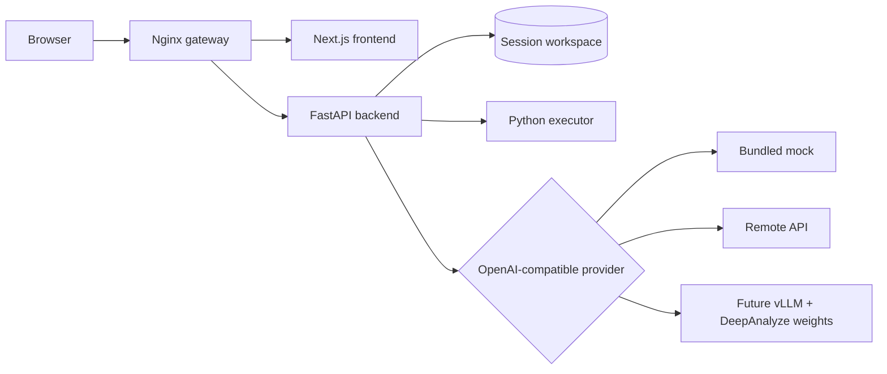

# DataPilot 架构

## 请求链路

浏览器只访问一个网关地址。`/api/*` 与 `/workspace/*` 进入 FastAPI，其余请求进入 Next.js。后端维护每个会话的工作区，向模型附加文件摘要，解析 DeepAnalyze 的结构化标签，并在需要时执行 Python、登记生成文件和导出报告。

## 关键设计

- **模型与产品解耦**：前端只认识 DataPilot API；模型端只需兼容 OpenAI chat completions 流式协议。
- **渐进式复现**：mock 用于开发和公开演示，远程 API 用于真实能力，GPU 自托管权重是最后一步。
- **可替换 provider**：`local` 对接 vLLM/mock，`custom` 对接通用兼容 API，保留上游 HeyWhale 路径。
- **持久工作区**：Compose 使用命名卷保存上传文件与生成产物；模型权重不进入 Git 或应用镜像。
- **兼容上游**：保留 `DeepAnalyze-8B` 模型标识和结构化推理协议，以便未来直接替换 provider。

## 安全边界

会话 ID 会净化，上传大小默认限制为 50MB，外部 URL 代理默认关闭，生成代码的子进程不会继承名称包含 API key、token、secret 或 password 的环境变量。当前本地执行模式适合单用户作品集演示，不应作为不受信任的多租户沙箱；详情见 [SECURITY.md](../SECURITY.md)。
